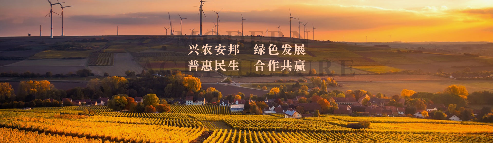

# jq-slide
自己封装一个简单的jq轮播插件
## 关于 jq-Cslide 轮播插件文档
#### html结构

```javascript
//正常轮播时的结构
<ul class="banner-img-box">
    <li></li>
    <li></li>
    <li></li>
</ul>
// 当开启无缝轮播时的结构
/*
 * 无缝切换原理：
 * 当开启无缝轮播时，插件会将轮播元素的最后一个克隆出来插入到父级第一个，
 * 将轮播元素的第一个克隆出来，插入到父级的最后一个。
 * 所以，当图片轮播到最后一个时显示的是初始时的第一张图片，
 * 而当最后一个元素滚动效果完时，触发animate中的回调，将滚动距离重置为初始时第一张图片的位置，
 * 因为js运行非常快，而且是相同图片，人眼是分辨不出的，这样就重新开始切换。
 * 也就给人一种错觉，图片一直朝一个方向在滚动着
 * 反方向同理，当图片滚动到初始时最后一张图片时，立马切换到对应克隆的那张图片
 */
<ul class="banner-img-box">
    <li></li>
    // 下方图片为初始第一张图片
    <li></li>
    <li></li>
    <li></li>
    // 上方图片为初始最后一张图片
    <li></li>
</ul>
```
#### 整体结构

```javascript
<div class="homePage-banner">
    <div class="banner-box">
      <ul class="banner-img-box">
        <li></li>
        <li></li>
        <li></li>
      </ul> 
      <ol class="banner-tab">
      </ol> 
    </div>
    <a class="prev" href="javascript:;">上一个</a>
    <a class="next" href="javascript:;">下一个</a>
</div>
```

#### 关于css
- 插件没有太多关注css,所以可以样式的使用就按需求实现即可

#### API
- imgBox: $('.banner-img-box'),  //轮播元素的父级，对应上面结构的 ul
- tabEl: $('.banner-tab'),       // tab切换元素的父级，对应上面结构的ol
- prev: $('.prev'),             // 左右切换按钮  “上一个” ，对应上面结构的 a标签prev
- next: $('next'),              // 左右切换按钮 “下一个” ，....
- tabShow: true,                // 是否显示tab切换按钮，默认为 false，不显示
- btnRoll: true,                // 是否开启 左右切换按钮，默认false， 不开启，若要使用左右切换，记得在js中开启该选项
- loopItem: true,               // 是否开启无缝轮播，默认开启 true
- direction: 'top',             // 选择切换方向，四个方向可选，top,bottom,left,right
- tabSpeed: 2000,               // 图片切换间隔，默认2s
- animateSpeed: 1000,           // 切换效果所需时间，默认为1s,
- autoPlay : true               // 是否开启自动轮播，默认开启 true

#### 注意事项
- imgBox，tabEl，prev，next 这4个选项传入的都是jq对象，对象的class可以自由命名，只要对应好结构即可，但是prev，next 最好能够使用例子中的命名，并且要防止命名冲突
- prev，next 按钮，在demo中并没有添加任何样式，所以这两个按钮虽然开启了，但仍然是看不到的，想要测试可自行添加样式
